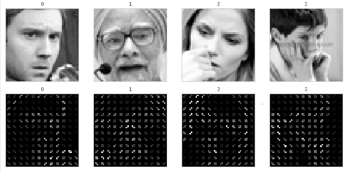

# Mini-Project for Fundamentals of Machine Learning Course

This repository contains the code and data for a mini-project on facial expression recognition using machine learning algorithms.

## 📑 Project Policy
- Team: group should consist of 3-4 students.

    |No.| Student Name    | Student ID |
    |:--------:|:--------:|:-------:|
    |1|Nguyễn Quang Trường |2110429|
    |2|Huỳnh Long Hải|21110286|
    |3|||
    |4|||

- The submission deadline is strict: **11:59 PM** on **June 22nd, 2024**. Commits pushed after this deadline will not be considered.

## 📦 Project Structure

The repository is organized into the following directories:

- **/data**: This directory contains the facial expression dataset. You'll need to download the dataset and place it here before running the notebooks. (Download link provided below)
- **/notebooks**: This directory contains the Jupyter notebook ```EDA.ipynb```. This notebook guides you through exploratory data analysis (EDA) and classification tasks.

## ⚙️ Usage

This project is designed to be completed in the following steps:

1. **Fork the Project**: Click on the ```Fork``` button on the top right corner of this repository, this will create a copy of the repository in your own GitHub account. Complete the table at the top by entering your team member names.

2. **Download the Dataset**: Download the facial expression dataset from the following [link](https://mega.nz/file/foM2wDaa#GPGyspdUB2WV-fATL-ZvYj3i4FqgbVKyct413gxg3rE) and place it in the **/data** directory:

3. **Complete the Tasks**: Open the ```notebooks/EDA.ipynb``` notebook in your Jupyter Notebook environment. The notebook is designed to guide you through various tasks, including:
    
    1. Prerequisite
    2. Principle Component Analysis
    3. Image Classification
    4. Evaluating Classification Performance 

    Make sure to run all the code cells in the ```EDA.ipynb``` notebook and ensure they produce output before committing and pushing your changes.

5. **Commit and Push Your Changes**: Once you've completed the tasks outlined in the notebook, commit your changes to your local repository and push them to your forked repository on GitHub.


Feel free to modify and extend the notebook to explore further aspects of the data and experiment with different algorithms. Good luck.

---------------------------------
<h1>Classification with FER2013 Dataset</h1>

# I. FER13 Dataset
- **FER2013** (*Facial Expression Recognition 2013 Dataset*) introduced by Goodfellow et al. in Challenges in Representation Learning: A report on three machine learning contests
- **FER2013** contains approximately 30,000 facial RGB images of different expressions with size restricted to 48×48, and the main labels of it can be divided into 7 types: `0=Angry`, `1=Disgust`, `2=Fear`, `3=Happy`, `4=Sad`, `5=Surprise`, `6=Neutral`. The `Disgust` expression has the minimal number of images – 600, while other labels have nearly 5,000 samples each.


# II. Preprocess data
## 1. Eigenfaces (PCA)


## 2. Image Processing with HOG (Histogram of Oriented Gradient) + Image Generation 
### 2.1 Feature Extractor with HOG
To diminish the
dimensionality curse and at the same time to attain high
recognition rate, there is dire need to select the most informative and relevant feature. 

Description of the shape of facial expression detection and local appearance are considerably described by HOG descriptors. A histogram of
gradient directions (edge orientations) of targeted image
is computed by dividing it into small connected regions
(cells) to implement these descriptors. The descriptor
is represented by combination of these histograms. The
algorithm is divided into multiple stages. Gradient values are computed as the first stage. Cell histograms are
created as second stage. Based on the values found in the
gradient computation for an orientation-based histogram
channel, each pixel within the cell casts a weighted vote.
The components of the normalized histograms are concatenated by the HOG descriptor as vector from all the
block regions. 

HOG features are comprised of gradients angles
and distribution of magnitude. Because of this fact, they
are naturally adaptable to variation in color and lighting
fluctuations. This fact witnesses their robustness in visual
data.

<div style="text-align: center">
  
  <p>Hog features on random images</p>
</div>


# III. Models
| **Model**                    |         **Dataset**          |
|:-----------------------------|:----------------------------:|
| Logistic Regression          | PCA / Original data with HOG |
| Decision Tree                | PCA / Original data with HOG |
| Random Forest                | PCA / Original data with HOG |
| Support Vector Machine (SVM) | PCA / Original data with HOG |
| Multi-layer Perceptron (MLP) | PCA / Original data with HOG |
| XGBoost Classifier           | PCA / Original data with HOG |
| CNN + HOG Feature Extractor  |    Original data (Images)    |

# IV. Hyperparameter Tuning
## 1. Bayes Search with Optuna
## 2. Grid Search find optimal parameters

# V. Results & Summary
| **Model**                    |         **Dataset**          |
|:-----------------------------|:----------------------------:|
| Logistic Regression          | PCA / Original data with HOG |
| Decision Tree                | PCA / Original data with HOG |
| Random Forest                | PCA / Original data with HOG |
| Support Vector Machine (SVM) | PCA / Original data with HOG |
| Multi-layer Perceptron (MLP) | PCA / Original data with HOG |
| XGBoost Classifier           | PCA / Original data with HOG |
| CNN + HOG Feature Extractor  |    Original data (Images)    |

# VI. Future Works

